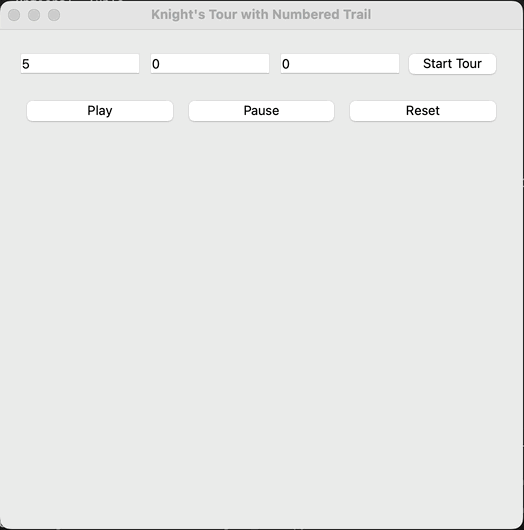
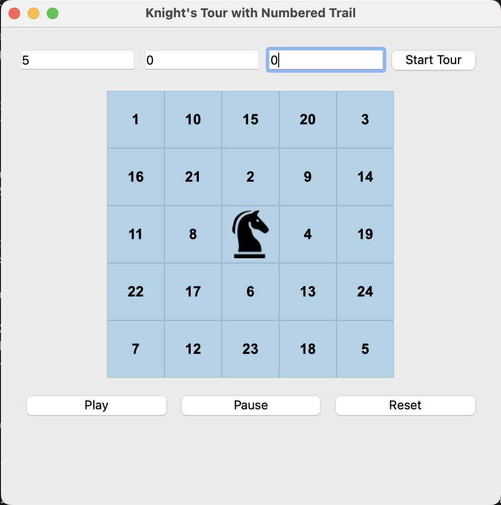
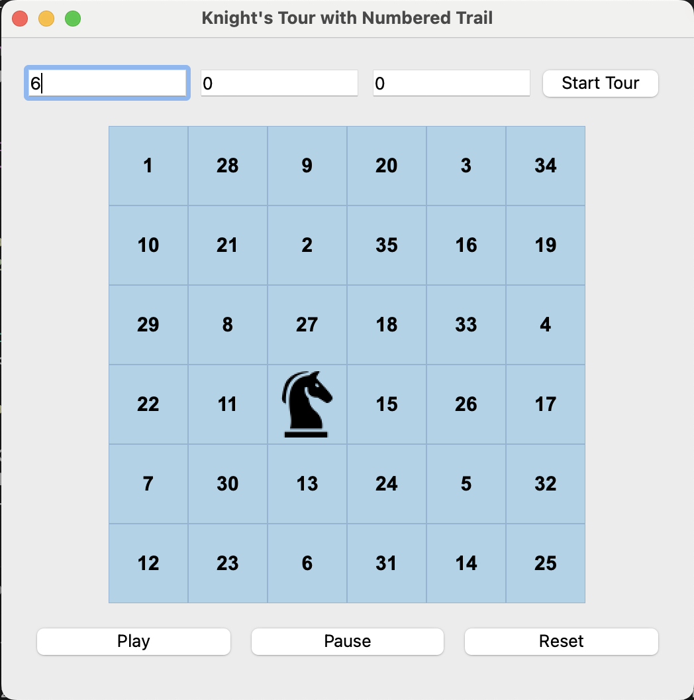

# ♞ Knight's Tour Visualizer

A Python mini-project that visualizes the **Knight's Tour** on an `n × n` chessboard using **PyQt5**. The knight moves through the board one square at a time following legal L-shaped moves, visiting every square **exactly once**. As the knight travels, each visited square displays the move number it was reached in.

<p align="center">
  
</p>

---

## Features

- ✅ Custom board size (min 5×5)
- ✅ Select starting square (row, column)
- ✅ Smooth animated knight movement
- ✅ Move number trail on visited squares
- ✅ Uniform square colors (modern look)
- ✅ Play / Pause / Reset controls
- ✅ Auto-fit board size and knight icon
- ✅ Responsive and interactive PyQt5 GUI

---

## Getting Started

### Prerequisites

Make sure you have Python 3.7 or later installed. Then install the required package:

```bash
pip install PyQt5
````

---

### Installation

```bash
git clone https://github.com/yourusername/knights-tour-visualizer.git
cd knights-tour-visualizer
python knights_tour.py
```

Make sure the file `knight.png` (an image of a chess knight) is in the same folder as the script.

---

## Usage

1. Enter the board size (e.g., `5` for 5×5)
2. Enter the start row and column (both 0-indexed)
3. Click **"Start Tour"**
4. Use **Play / Pause / Reset** to control the animation

If a valid tour isn’t found from the starting square, the app will inform you to try again with a different configuration.

---

## Project Structure

```
knights-tour-visualizer/
├── knights_tour.py          # Main GUI application
├── knight.png               # Knight icon image
├── requirements.txt         # Python dependencies
├── README.md                # This file
└── screenshots/
    └── demo.gif             # Demo animation
```

---

## Screenshots

<p float="left">
  
  
</p>

---

## Algorithm

This project uses a heuristic-based approach inspired by **Warnsdorff’s Rule**, where the knight always moves to the square with the fewest onward moves. Multiple attempts are made with randomized move order to find a valid complete tour.
